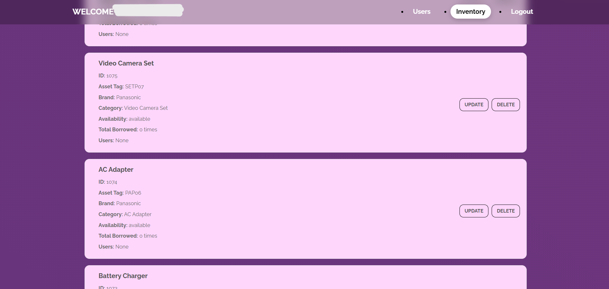
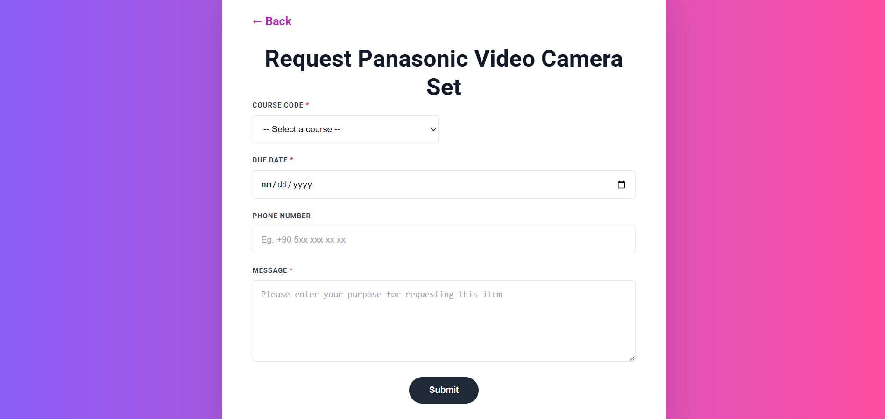

# Equipment Management System

**Created by: Elifnur Ozcelik, Eda Abacioglu, Basak Uran**

## Description
Equipment Management System is a web-based application designed to manage equipment records, lending requests, and approval processes.

Students can browse available equipment and submit lending requests. Instructors and the chair can review these requests and approve or reject them. Administrators are responsible for managing users, equipment records, and other system-related operations.

The project was developed as part of an academic web development project. It focuses on role-based access, equipment management, request workflows, and approval processes.

## User Roles
- Student – Browse available equipment and submit lending requests.
- Instructor – Review and approve or reject student requests.
- Chair – Review requests and provide approval or rejection.
- Admin – Manage users, equipment, and other system-related data.

## Key Features
🎥 Equipment browsing and management

📋 Equipment lending requests

✅ Request approval and rejection workflow

👥 Role-based user access

🛠️ Administrative management

📧 Email notifications for request status updates

## Technologies Used
- PHP
- MySQL
- HTML
- CSS
- JavaScript
- PHPMailer
- phpMyAdmin

## Application Flow
**Student** → Browse equipment → Submit lending request

**Instructor** → Review request → Approve / Reject

**Chair** → Review request → Approve / Reject

**Admin** → Manage users, equipment, and system data

## Screenshots  

Here are some screenshots of the project:

  
*Login screen.*

  
*Equipment browsing and management screen.*

  
*Equipment lending request form.*

  
*Equipment lending request status.*

## License  

See the [LICENSE](LICENSE) file for copyright and usage information.

## Last Updated  

August 2026
